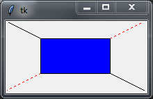
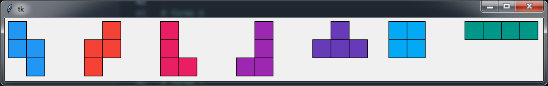
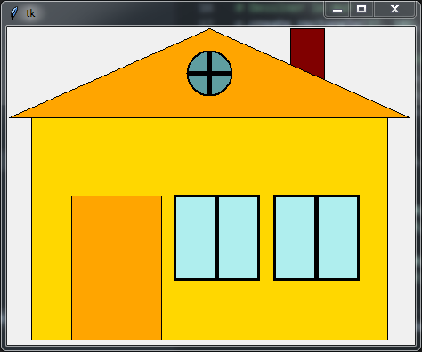
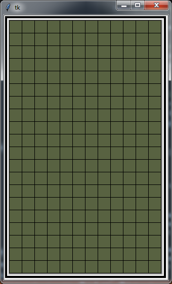
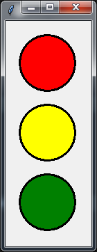
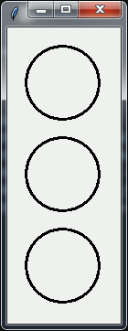
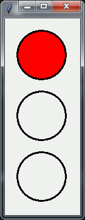

# Pensée computationnelle et programmation

## Séance du Samedi 21/09/2019

Dans la deuxième leçon nous avons commencé par décomposer l'interface de l'application.

Nous avons ensuite étudié [un petit programme Tkinter](./Lecon_02/question_7.py)

Nous avons modifié le programme précédent pour dessiner les pièces Tetris. [Le programme](./Lecon_02/question_8.py)

## Séance du Jeudi 26/09/2019

Dans la troisième séance, nous avons fait un rappel sur la séance précédente. Puis, nous avons présenté la pensée computationnelle tout en référant au Jeu Tetris.

Nous avons, par la suite, appliqué la pensée computationnelle afin de dessiner la figure d'une maison.

[Solution](./Lecon_3/question_3.py)

## Séance du Samedi 28/09/2019

Dans la quatrième séance nous nous sommes intéressés à la grille du jeu. Nous avons déterminé les caractéristiques et les opérations de cette grille de jeu. Nous avons ensuite commencé par la première opération : Initialiser la grille du jeu.

## Séance du Mardi 01/10/2019

Dans la cinquième séance, nous avons commencé par présenter les structures conditionnelles en Python à travers le programme qui détermine [Le plus agé](./Lecon_05/plus_age.py).

Ensuite, nous avons essayé de dessiner un feu de circulation. Nous avons utilisé des constantes dans le calcul des différentes dimensions utilisés afin de permettre une certaine flexibilité dans le [programme](./Lecon_05/programme_v02.py).

Pour ajouter de la vie à notre travail, nous avons utilisé un timer pour [faire clignoter les trois feux en même temps](./Lecon_05/programme_v03.py).

Notre programme a été, par la suite, amélioré :

* [La première amélioration](./Lecon_05/programme_v04.py)

* [La deuxième amélioration](./Lecon_05/programme_v05.py)

